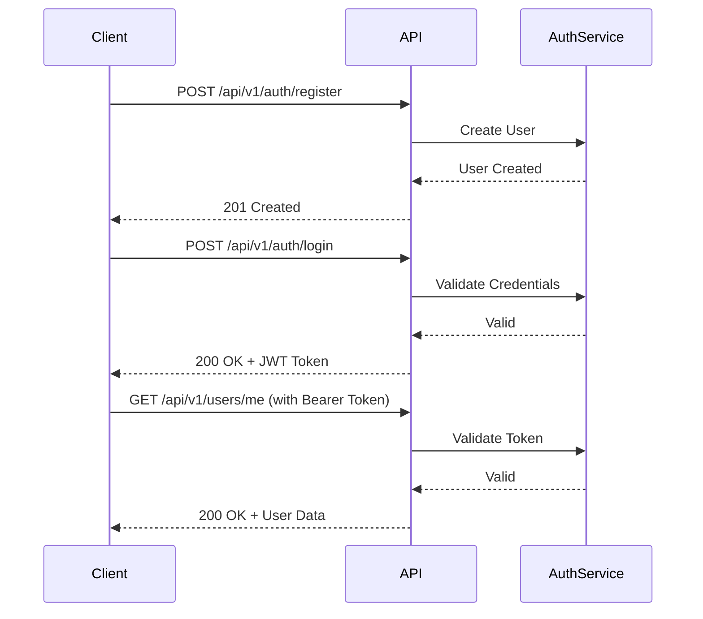
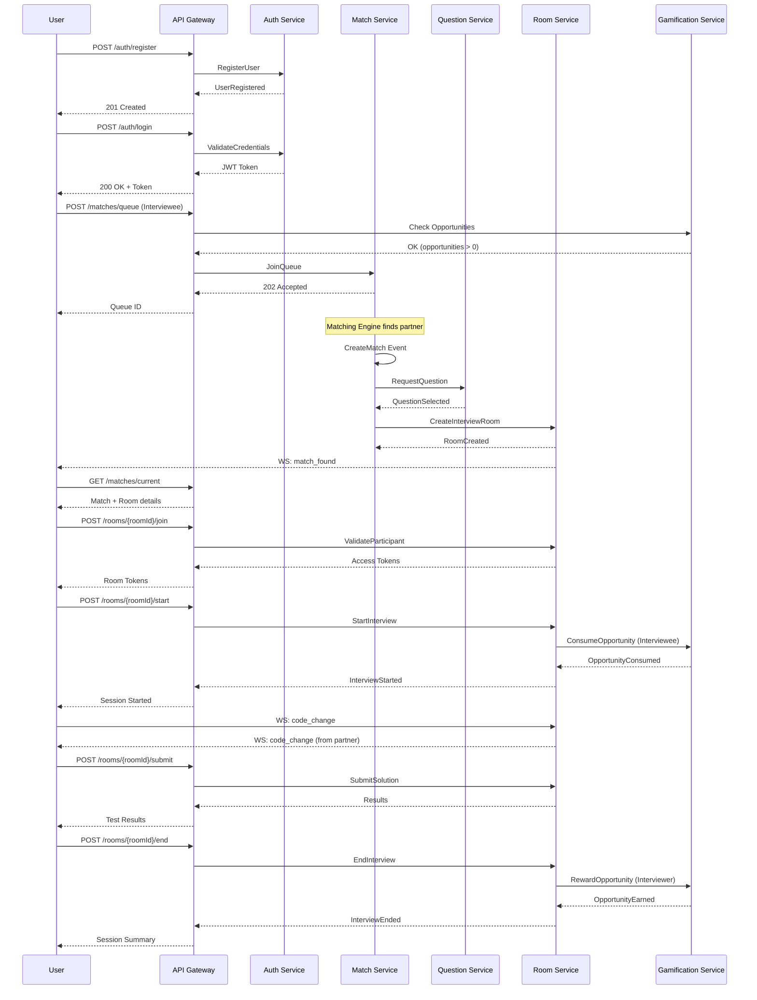

# CodeMeet API Design Document

> 基於 Event Storming 設計的 RESTful API 規範

## 目錄

- [API 設計原則](#api-設計原則)
- [認證與授權](#認證與授權)
- [通用回應格式](#通用回應格式)
- [API 端點](#api-端點)
  - [1. User Service](#1-user-service)
  - [2. Matchmaking Service](#2-matchmaking-service)
  - [3. Question Service](#3-question-service)
  - [4. Interview Room Service](#4-interview-room-service)
  - [5. Gamification Service](#5-gamification-service)
- [WebSocket Events](#websocket-events)
- [錯誤碼對照表](#錯誤碼對照表)

---

## API 設計原則

1. **RESTful 設計**: 使用標準 HTTP 方法 (GET, POST, PUT, DELETE)
2. **資源導向**: URL 以資源為中心,避免動詞
3. **版本控制**: API 路徑包含版本號 `/api/v1/...`
4. **統一回應格式**: 成功與錯誤皆使用一致的 JSON 格式
5. **冪等性**: PUT/DELETE 操作保證冪等
6. **分頁支援**: 列表查詢支援 `page` 和 `pageSize` 參數

---

## 認證與授權

### Bearer Token 認證

所有需要認證的端點需在 Header 中提供 JWT Token:

```http
Authorization: Bearer <JWT_TOKEN>
```

### 認證流程



---

## 通用回應格式

### 成功回應

直接返回資料，不做額外包裝：

```json
{ "id": "...", "username": "..." }
```

### 錯誤回應

使用 RFC 7807 ProblemDetails 格式：

```json
{
  "type": "https://tools.ietf.org/html/rfc7807",
  "title": "Not Found",
  "status": 404,
  "detail": "使用者不存在",
  "traceId": "00-abc123..."
}
```

### 驗證錯誤回應

```json
{
  "type": "https://tools.ietf.org/html/rfc7807",
  "title": "One or more validation errors occurred.",
  "status": 400,
  "errors": {
    "Email": ["Email is required"],
    "Password": ["Password must be at least 8 characters"]
  },
  "traceId": "00-abc123..."
}
```

### 分頁回應

```json
{
  "items": [...],
  "pagination": {
    "page": 1,
    "pageSize": 20,
    "totalItems": 100,
    "totalPages": 5
  }
}
```

---

## API 端點

## 1. User Service

### 1.1 註冊使用者

**Command**: `RegisterUser`
**Event**: `UserRegistered`

```http
POST /api/v1/users/register
```

**Request Body**:
```json
{
  "email": "user@example.com",
  "password": "SecurePassword123!",
  "displayName": "John Doe",
  "timezone": "Asia/Taipei"
}
```

**Response** (201 Created):
```json
{
  "userId": "usr_1234567890",
  "email": "user@example.com",
  "displayName": "John Doe",
  "createdAt": "2025-12-08T10:30:00Z"
}
```

**Errors**:
- `400 BAD_REQUEST`: 驗證失敗
- `409 CONFLICT`: Email 已存在

---

### 1.2 使用者登入

```http
POST /api/v1/auth/login
```

**Request Body**:
```json
{
  "email": "user@example.com",
  "password": "SecurePassword123!"
}
```

**Response** (200 OK):
```json
{
  "accessToken": "eyJhbGciOiJIUzI1NiIsInR5cCI6IkpXVCJ9...",
  "refreshToken": "refresh_token_here",
  "expiresIn": 3600,
  "user": {
    "userId": "usr_1234567890",
    "email": "user@example.com",
    "displayName": "John Doe"
  }
}
```

---

### 1.3 取得當前使用者資訊

```http
GET /api/v1/users/me
Authorization: Bearer <token>
```

**Response** (200 OK):
```json
{
  "userId": "usr_1234567890",
  "email": "user@example.com",
  "displayName": "John Doe",
  "preferences": {
    "languages": ["JavaScript", "Python"],
    "difficulty": "Medium",
    "enableVideo": true
  },
  "opportunities": 1,
  "createdAt": "2025-12-08T10:30:00Z"
}
```

---

### 1.4 更新使用者偏好設定

**Command**: `UpdateUserPreferences`
**Event**: `UserProfileUpdated`

```http
PUT /api/v1/users/me/preferences
Authorization: Bearer <token>
```

**Request Body**:
```json
{
  "languages": ["TypeScript", "Go"],
  "difficulty": "Hard",
  "enableVideo": false
}
```

**Response** (200 OK):
```json
{
  "preferences": {
    "languages": ["TypeScript", "Go"],
    "difficulty": "Hard",
    "enableVideo": false
  },
  "updatedAt": "2025-12-08T11:00:00Z"
}
```

---

## 2. Matchmaking Service

### 2.1 加入配對隊列

**Command**: `JoinMatchQueue`
**Event**: `UserJoinedQueue`

```http
POST /api/v1/matches/queue
Authorization: Bearer <token>
```

**Request Body**:
```json
{
  "role": "interviewee",
  "language": "TypeScript",
  "difficulty": "Medium",
  "enableVideo": true
}
```

**Response** (202 Accepted):
```json
{
  "queueId": "queue_1234567890",
  "status": "waiting",
  "estimatedWaitTime": 30,
  "enteredAt": "2025-12-08T11:00:00Z"
}
```

**Errors**:
- `403 FORBIDDEN`: 面試機會不足 (opportunities = 0, role = interviewee)
- `409 CONFLICT`: 已在隊列中

---

### 2.2 取消配對

```http
DELETE /api/v1/matches/queue/{queueId}
Authorization: Bearer <token>
```

**Response** (204 No Content)

---

### 2.3 查詢配對狀態

```http
GET /api/v1/matches/queue/{queueId}
Authorization: Bearer <token>
```

**Response** (200 OK):
```json
{
  "queueId": "queue_1234567890",
  "status": "matched",
  "matchId": "match_9876543210",
  "partner": {
    "displayName": "Jane Smith",
    "role": "interviewer"
  }
}
```

**Status 可能值**:
- `waiting`: 等待配對中
- `matched`: 已配對成功
- `cancelled`: 已取消
- `expired`: 已過期

---

### 2.4 取得當前配對

```http
GET /api/v1/matches/current
Authorization: Bearer <token>
```

**Response** (200 OK):
```json
{
  "matchId": "match_9876543210",
  "participants": [
    {
      "userId": "usr_1234567890",
      "role": "interviewee",
      "displayName": "John Doe"
    },
    {
      "userId": "usr_0987654321",
      "role": "interviewer",
      "displayName": "Jane Smith"
    }
  ],
  "question": {
    "questionId": "q_111222333",
    "title": "Two Sum",
    "difficulty": "Easy"
  },
  "room": {
    "roomId": "room_555666777",
    "videoUrl": "https://video.codemeet.com/room_555666777",
    "editorUrl": "wss://editor.codemeet.com/room_555666777"
  },
  "status": "active",
  "createdAt": "2025-12-08T11:05:00Z"
}
```

---

## 3. Question Service

### 3.1 取得題目詳情

```http
GET /api/v1/questions/{questionId}
Authorization: Bearer <token>
```

**Response** (200 OK):
```json
{
  "questionId": "q_111222333",
  "title": "Two Sum",
  "difficulty": "Easy",
  "category": "Array",
  "description": "Given an array of integers nums and an integer target...",
  "examples": [
    {
      "input": "nums = [2,7,11,15], target = 9",
      "output": "[0,1]",
      "explanation": "Because nums[0] + nums[1] == 9, we return [0, 1]."
    }
  ],
  "constraints": [
    "2 <= nums.length <= 10^4",
    "-10^9 <= nums[i] <= 10^9"
  ],
  "hints": [
    "Use a hash map to store the numbers you've seen so far"
  ],
  "starterCode": {
    "javascript": "function twoSum(nums, target) {\n  // Your code here\n}",
    "python": "def two_sum(nums, target):\n    # Your code here\n    pass"
  }
}
```

---

### 3.2 取得隨機題目 (測試用)

```http
GET /api/v1/questions/random?difficulty=Medium&language=JavaScript
Authorization: Bearer <token>
```

**Response** (200 OK): 同 3.1

---

### 3.3 搜尋題目 (管理員)

```http
GET /api/v1/questions?page=1&pageSize=20&difficulty=Medium&category=Array
Authorization: Bearer <admin_token>
```

**Response** (200 OK):
```json
{
  "items": [
    {
      "questionId": "q_111222333",
      "title": "Two Sum",
      "difficulty": "Easy",
      "category": "Array"
    }
  ],
  "pagination": {
    "page": 1,
    "pageSize": 20,
    "totalItems": 150,
    "totalPages": 8
  }
}
```

---

## 4. Interview Room Service

### 4.1 建立面試房間

**Command**: `CreateInterviewRoom`
**Event**: `InterviewRoomCreated`

> 此端點通常由系統自動呼叫,當配對成功後觸發

```http
POST /api/v1/rooms
Authorization: Bearer <system_token>
```

**Request Body**:
```json
{
  "matchId": "match_9876543210",
  "questionId": "q_111222333",
  "participants": [
    "usr_1234567890",
    "usr_0987654321"
  ]
}
```

**Response** (201 Created):
```json
{
  "roomId": "room_555666777",
  "videoUrl": "https://video.codemeet.com/room_555666777",
  "editorUrl": "wss://editor.codemeet.com/room_555666777",
  "expiresAt": "2025-12-08T12:05:00Z"
}
```

---

### 4.2 加入面試房間

```http
POST /api/v1/rooms/{roomId}/join
Authorization: Bearer <token>
```

**Response** (200 OK):
```json
{
  "roomId": "room_555666777",
  "accessToken": "room_access_token_here",
  "videoToken": "video_service_token",
  "editorToken": "editor_service_token"
}
```

**Errors**:
- `403 FORBIDDEN`: 非房間成員
- `410 GONE`: 房間已過期

---

### 4.3 開始面試

**Command**: `StartInterview`
**Event**: `InterviewStarted`, `OpportunityConsumed` (if interviewee)

```http
POST /api/v1/rooms/{roomId}/start
Authorization: Bearer <token>
```

**Response** (200 OK):
```json
{
  "sessionId": "session_123456",
  "startedAt": "2025-12-08T11:10:00Z",
  "questionDetails": {
    "questionId": "q_111222333",
    "title": "Two Sum",
    "difficulty": "Easy"
  }
}
```

---

### 4.4 提交程式碼

**Command**: `SubmitSolution`
**Event**: `SolutionSubmitted`

```http
POST /api/v1/rooms/{roomId}/submit
Authorization: Bearer <token>
```

**Request Body**:
```json
{
  "language": "javascript",
  "code": "function twoSum(nums, target) { ... }",
  "testCases": [
    {
      "input": "[2,7,11,15], 9",
      "expectedOutput": "[0,1]"
    }
  ]
}
```

**Response** (200 OK):
```json
{
  "submissionId": "sub_789012",
  "status": "accepted",
  "results": [
    {
      "testCase": 1,
      "passed": true,
      "runtime": "52ms",
      "memory": "42.1MB"
    }
  ],
  "submittedAt": "2025-12-08T11:20:00Z"
}
```

**Status 可能值**:
- `accepted`: 通過所有測試
- `wrong_answer`: 答案錯誤
- `runtime_error`: 執行錯誤
- `time_limit_exceeded`: 超時
- `compile_error`: 編譯錯誤

---

### 4.5 給予反饋

**Command**: `GiveFeedback`
**Event**: `FeedbackGiven`

```http
POST /api/v1/rooms/{roomId}/feedback
Authorization: Bearer <token>
```

**Request Body**:
```json
{
  "targetUserId": "usr_1234567890",
  "rating": 4,
  "comment": "Good problem-solving approach, consider edge cases more carefully.",
  "strengths": ["clear communication", "logical thinking"],
  "improvements": ["edge case handling", "time complexity analysis"]
}
```

**Response** (201 Created):
```json
{
  "feedbackId": "fb_345678",
  "createdAt": "2025-12-08T11:55:00Z"
}
```

---

### 4.6 結束面試

**Command**: `EndInterview`
**Event**: `InterviewEnded`, `SessionCompleted`, `OpportunityEarned` (if interviewer)

```http
POST /api/v1/rooms/{roomId}/end
Authorization: Bearer <token>
```

**Response** (200 OK):
```json
{
  "sessionId": "session_123456",
  "duration": 3540,
  "endedAt": "2025-12-08T12:00:00Z",
  "summary": {
    "questionsAsked": 3,
    "solutionsSubmitted": 2,
    "feedbackExchanged": true
  }
}
```

---

### 4.7 取得面試歷史

```http
GET /api/v1/rooms/history?page=1&pageSize=10
Authorization: Bearer <token>
```

**Response** (200 OK):
```json
{
  "items": [
    {
      "sessionId": "session_123456",
      "roomId": "room_555666777",
      "myRole": "interviewee",
      "partner": {
        "displayName": "Jane Smith",
        "role": "interviewer"
      },
      "question": {
        "title": "Two Sum",
        "difficulty": "Easy"
      },
      "duration": 3540,
      "feedback": {
        "rating": 4,
        "comment": "Good problem-solving approach..."
      },
      "startedAt": "2025-12-08T11:10:00Z",
      "endedAt": "2025-12-08T12:00:00Z"
    }
  ],
  "pagination": {
    "page": 1,
    "pageSize": 10,
    "totalItems": 25,
    "totalPages": 3
  }
}
```

---

## 5. Gamification Service

### 5.1 取得使用者機會數

```http
GET /api/v1/gamification/opportunities
Authorization: Bearer <token>
```

**Response** (200 OK):
```json
{
  "userId": "usr_1234567890",
  "opportunities": 2,
  "nextResetAt": "2025-12-09T00:00:00Z",
  "history": [
    {
      "type": "consumed",
      "amount": -1,
      "reason": "Started interview as interviewee",
      "timestamp": "2025-12-08T11:10:00Z"
    },
    {
      "type": "earned",
      "amount": 1,
      "reason": "Completed interview as interviewer",
      "timestamp": "2025-12-08T10:00:00Z"
    },
    {
      "type": "reset",
      "amount": 1,
      "reason": "Daily reset",
      "timestamp": "2025-12-08T00:00:00Z"
    }
  ]
}
```

---

### 5.2 消耗面試機會

**Command**: `ConsumeInterviewOpportunity`
**Event**: `OpportunityConsumed`

> 此端點通常由系統自動呼叫,當 Interviewee 開始面試時觸發

```http
POST /api/v1/gamification/opportunities/consume
Authorization: Bearer <system_token>
```

**Request Body**:
```json
{
  "userId": "usr_1234567890",
  "sessionId": "session_123456",
  "reason": "Started interview as interviewee"
}
```

**Response** (200 OK):
```json
{
  "opportunities": 0,
  "consumed": 1,
  "timestamp": "2025-12-08T11:10:00Z"
}
```

**Errors**:
- `403 FORBIDDEN`: 機會不足

---

### 5.3 獎勵面試機會

**Command**: `RewardInterviewOpportunity`
**Event**: `OpportunityEarned`

> 此端點通常由系統自動呼叫,當 Interviewer 完成面試時觸發

```http
POST /api/v1/gamification/opportunities/reward
Authorization: Bearer <system_token>
```

**Request Body**:
```json
{
  "userId": "usr_0987654321",
  "sessionId": "session_123456",
  "reason": "Completed interview as interviewer"
}
```

**Response** (200 OK):
```json
{
  "opportunities": 2,
  "earned": 1,
  "timestamp": "2025-12-08T12:00:00Z"
}
```

---

### 5.4 每日重置 (系統排程)

**Policy**: `Daily Reset Policy`
**Event**: `DailyOpportunityReset`

> 此端點由 Cron Job 每日 00:00 自動呼叫

```http
POST /api/v1/gamification/opportunities/reset
Authorization: Bearer <system_token>
```

**Response** (200 OK):
```json
{
  "affectedUsers": 1523,
  "resetAt": "2025-12-09T00:00:00Z"
}
```

---

## WebSocket Events

面試房間使用 WebSocket 進行即時通訊。

### 連線

```javascript
const ws = new WebSocket('wss://api.codemeet.com/ws/rooms/{roomId}?token={jwt_token}');
```

### 事件格式

```json
{
  "event": "event_name",
  "data": { ... },
  "timestamp": "2025-12-08T11:10:00Z",
  "sender": "usr_1234567890"
}
```

### 支援的事件

#### 1. 使用者加入/離開

**接收事件**:
```json
{
  "event": "user_joined",
  "data": {
    "userId": "usr_0987654321",
    "displayName": "Jane Smith",
    "role": "interviewer"
  }
}
```

```json
{
  "event": "user_left",
  "data": {
    "userId": "usr_0987654321",
    "reason": "disconnected"
  }
}
```

#### 2. 程式碼同步

**發送事件**:
```json
{
  "event": "code_change",
  "data": {
    "language": "javascript",
    "code": "function twoSum(nums, target) { ... }",
    "cursorPosition": {
      "line": 5,
      "column": 10
    }
  }
}
```

**接收事件**: 同上格式,包含 `sender` 資訊

#### 3. 訊息聊天

**發送事件**:
```json
{
  "event": "chat_message",
  "data": {
    "message": "Let's start with the brute force approach"
  }
}
```

**接收事件**:
```json
{
  "event": "chat_message",
  "data": {
    "message": "Let's start with the brute force approach",
    "sender": {
      "userId": "usr_0987654321",
      "displayName": "Jane Smith"
    },
    "timestamp": "2025-12-08T11:15:00Z"
  }
}
```

#### 4. 程式執行結果

**發送事件**:
```json
{
  "event": "run_code",
  "data": {
    "language": "javascript",
    "code": "console.log(twoSum([2,7,11,15], 9));",
    "input": ""
  }
}
```

**接收事件**:
```json
{
  "event": "code_output",
  "data": {
    "output": "[0, 1]",
    "error": null,
    "runtime": "52ms"
  }
}
```

#### 5. 面試狀態變更

**接收事件**:
```json
{
  "event": "interview_started",
  "data": {
    "sessionId": "session_123456",
    "startedAt": "2025-12-08T11:10:00Z"
  }
}
```

```json
{
  "event": "interview_ended",
  "data": {
    "sessionId": "session_123456",
    "endedAt": "2025-12-08T12:00:00Z",
    "duration": 3540
  }
}
```

---

## 錯誤碼對照表

| HTTP Code | Error Code | 說明 |
|-----------|------------|------|
| 400 | `VALIDATION_ERROR` | 請求參數驗證失敗 |
| 400 | `INVALID_CREDENTIALS` | 帳號或密碼錯誤 |
| 401 | `UNAUTHORIZED` | 未提供或無效的認證 Token |
| 403 | `FORBIDDEN` | 沒有權限執行此操作 |
| 403 | `INSUFFICIENT_OPPORTUNITIES` | 面試機會不足 |
| 404 | `USER_NOT_FOUND` | 使用者不存在 |
| 404 | `MATCH_NOT_FOUND` | 配對不存在 |
| 404 | `ROOM_NOT_FOUND` | 房間不存在 |
| 404 | `QUESTION_NOT_FOUND` | 題目不存在 |
| 409 | `CONFLICT` | 資源衝突 (如 Email 已存在) |
| 409 | `ALREADY_IN_QUEUE` | 已在配對隊列中 |
| 410 | `GONE` | 資源已過期或已刪除 |
| 429 | `RATE_LIMIT_EXCEEDED` | 超過請求頻率限制 |
| 500 | `INTERNAL_SERVER_ERROR` | 伺服器內部錯誤 |
| 503 | `SERVICE_UNAVAILABLE` | 服務暫時不可用 |

---

## API 流程圖

### 完整使用者旅程



---

## 版本歷史

| 版本 | 日期 | 變更內容 |
|------|------|----------|
| 1.0.0 | 2025-12-08 | 初始版本,基於 Event Storming 設計 |

---

## 附錄

### A. 速率限制

| 端點類型 | 限制 |
|---------|------|
| 認證端點 | 5 requests / min |
| 一般 API | 100 requests / min |
| WebSocket | 1000 messages / min |

### B. 分頁參數

所有支援分頁的端點接受以下查詢參數:

- `page`: 頁碼 (從 1 開始,預設 1)
- `pageSize`: 每頁筆數 (預設 20, 最大 100)
- `sortBy`: 排序欄位 (預設依資源而定)
- `sortOrder`: `asc` 或 `desc` (預設 `desc`)

範例:
```http
GET /api/v1/rooms/history?page=2&pageSize=10&sortBy=createdAt&sortOrder=desc
```

### C. 時區處理

- 所有時間戳記使用 ISO 8601 格式 UTC 時間
- 使用者可在 Profile 設定時區偏好
- 前端負責將 UTC 時間轉換為使用者本地時間

---

**文件維護**: 此文件應隨 Event Storming 和系統需求變更而更新
