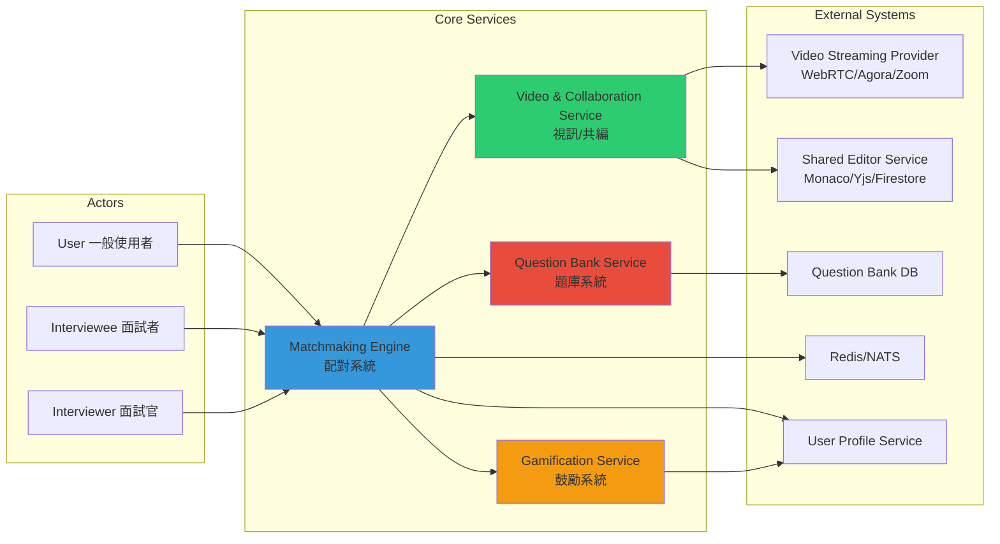
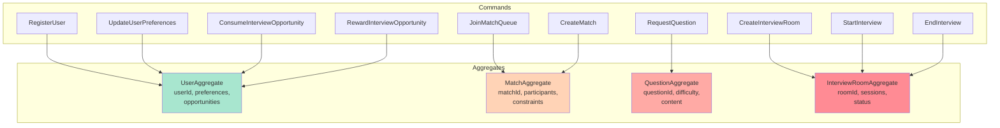
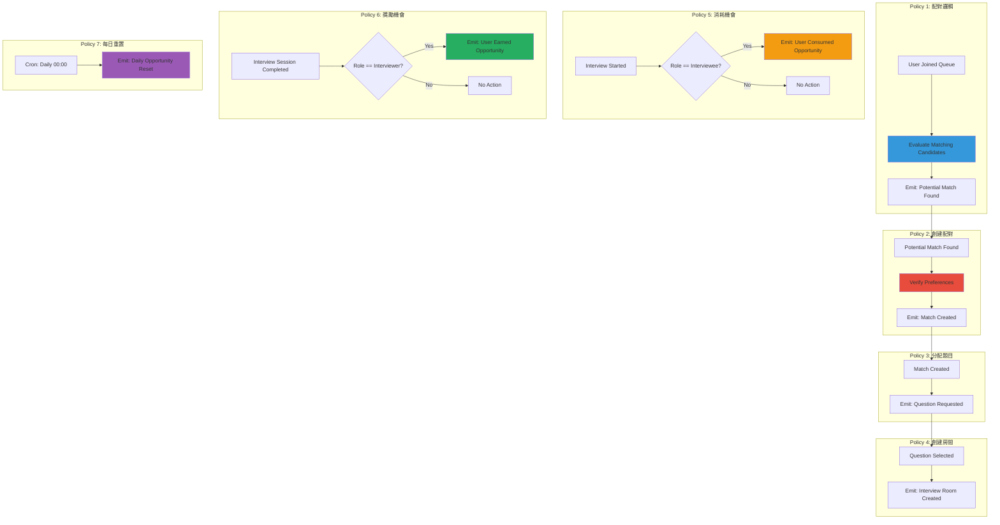
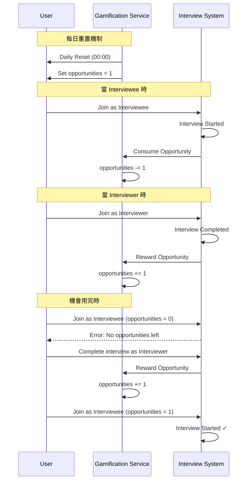
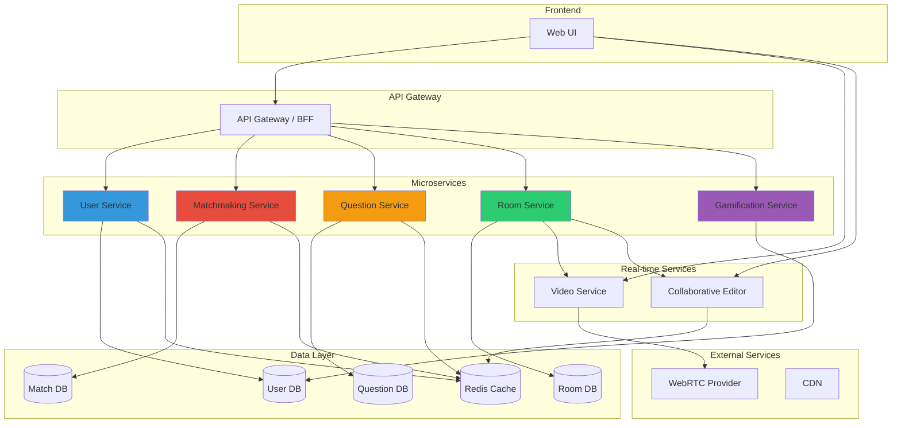

# Event Storming - 即時自由模擬面試匹配平台 MVP

## Event Storming 圖例

| 元素 | 顏色 | 說明 |
|------|------|------|
| **Event** | 🟧 橘色 | 已發生的領域事件（過去式） |
| **Command** | 🟦 藍色 | 使用者或系統觸發的指令 |
| **Actor** | 🟨 黃色 | 執行 Command 的人或系統 |
| **Aggregate** | 🟨 淺黃 | 領域聚合根 |
| **Policy** | 🟪 紫色 | 自動化規則（whenever... then...） |
| **Read Model** | 🟩 綠色 | 查詢模型/視圖 |
| **External System** | 🟥 粉紅 | 外部系統 |

---

## 完整 Event Storming（按時間軸從左到右）

```mermaid
graph LR
    %% ============ 階段 1: 使用者註冊與設定 ============
    Actor1[👤 User]
    Cmd1[🔷 Register User]
    Evt1[🟧 User Registered]
    Agg1[📦 User Aggregate]

    Cmd2[🔷 Update User<br/>Preferences]
    Evt2[🟧 User Profile<br/>Updated]
    RM1[📊 User Profile<br/>View]

    Actor1 -->|執行| Cmd1
    Cmd1 -->|修改| Agg1
    Agg1 -->|產生| Evt1

    Actor1 -->|執行| Cmd2
    Cmd2 -->|修改| Agg1
    Agg1 -->|產生| Evt2
    Evt2 -->|更新| RM1

    %% ============ 階段 2: 配對流程 ============
    Cmd3[🔷 Join Match<br/>Queue]
    Evt3[🟧 User Joined<br/>Queue]
    Agg2[📦 Match Aggregate]

    Policy1[⚡ Matching Policy<br/>whenever user joins<br/>→ find candidates]

    Evt4[🟧 Potential Match<br/>Found]
    Cmd4[🔷 Create Match]
    Evt5[🟧 Match Created]

    ExtSys1[🔴 Matchmaking<br/>Engine]
    RM2[📊 Active Matches<br/>View]

    Actor1 -->|執行| Cmd3
    Cmd3 -->|修改| Agg2
    Agg2 -->|產生| Evt3

    Evt3 -->|觸發| Policy1
    Policy1 -->|使用| ExtSys1
    Policy1 -->|產生| Evt4

    Evt4 -->|觸發| Cmd4
    Cmd4 -->|修改| Agg2
    Agg2 -->|產生| Evt5
    Evt5 -->|更新| RM2

    %% ============ 階段 3: 題目選擇 ============
    Policy2[⚡ Question Policy<br/>whenever match created<br/>→ select question]

    Cmd5[🔷 Request Question]
    Evt6[🟧 Question<br/>Requested]
    Agg3[📦 Question<br/>Aggregate]

    ExtSys2[🔴 Question Bank<br/>Service]

    Evt7[🟧 Question Selected]
    RM3[📊 Question Details<br/>View]

    Evt5 -->|觸發| Policy2
    Policy2 -->|執行| Cmd5
    Cmd5 -->|查詢| Agg3
    Agg3 -->|產生| Evt6

    Evt6 -->|使用| ExtSys2
    ExtSys2 -->|產生| Evt7
    Evt7 -->|更新| RM3

    %% ============ 階段 4: 面試房間建立 ============
    Policy3[⚡ Room Policy<br/>whenever question ready<br/>→ create room]

    Cmd6[🔷 Create Interview<br/>Room]
    Evt8[🟧 Interview Room<br/>Created]
    Agg4[📦 Interview Room<br/>Aggregate]

    ExtSys3[🔴 Video Service]
    ExtSys4[🔴 Shared Editor]

    Evt9[🟧 Video Stream<br/>Started]
    Evt10[🟧 Shared Editor<br/>Ready]

    Evt7 -->|觸發| Policy3
    Policy3 -->|執行| Cmd6
    Cmd6 -->|修改| Agg4
    Agg4 -->|產生| Evt8

    Evt8 -->|使用| ExtSys3
    Evt8 -->|使用| ExtSys4
    ExtSys3 -->|產生| Evt9
    ExtSys4 -->|產生| Evt10

    %% ============ 階段 5: 面試開始 ============
    Actor2[👤 Interviewee]
    Actor3[👤 Interviewer]

    Cmd7[🔷 Start Interview]
    Evt11[🟧 Interview<br/>Started]

    Policy4[⚡ Gamification Policy<br/>whenever interview starts<br/>& role=interviewee<br/>→ consume opportunity]

    Evt12[🟧 Opportunity<br/>Consumed]
    Agg5[📦 Gamification<br/>Aggregate]
    RM4[📊 User Opportunities<br/>View]

    Actor2 -->|執行| Cmd7
    Actor3 -->|執行| Cmd7
    Cmd7 -->|修改| Agg4
    Agg4 -->|產生| Evt11

    Evt11 -->|觸發| Policy4
    Policy4 -->|修改| Agg5
    Agg5 -->|產生| Evt12
    Evt12 -->|更新| RM4

    %% ============ 階段 6: 面試進行 ============
    Cmd8[🔷 Ask Question]
    Evt13[🟧 Question Asked]

    Cmd9[🔷 Submit Solution]
    Evt14[🟧 Solution<br/>Submitted]

    Cmd10[🔷 Give Feedback]
    Evt15[🟧 Feedback Given]

    RM5[📊 Interview<br/>Progress View]

    Actor3 -->|執行| Cmd8
    Cmd8 -->|修改| Agg4
    Agg4 -->|產生| Evt13

    Actor2 -->|執行| Cmd9
    Cmd9 -->|修改| Agg4
    Agg4 -->|產生| Evt14

    Actor3 -->|執行| Cmd10
    Cmd10 -->|修改| Agg4
    Agg4 -->|產生| Evt15

    Evt13 -->|更新| RM5
    Evt14 -->|更新| RM5
    Evt15 -->|更新| RM5

    %% ============ 階段 7: 面試結束 ============
    Cmd11[🔷 End Interview]
    Evt16[🟧 Interview Ended]

    Policy5[⚡ Reward Policy<br/>whenever interview ends<br/>& role=interviewer<br/>→ reward opportunity]

    Evt17[🟧 Opportunity<br/>Earned]

    Evt18[🟧 Session<br/>Completed]
    RM6[📊 Interview History<br/>View]

    Actor2 -->|執行| Cmd11
    Actor3 -->|執行| Cmd11
    Cmd11 -->|修改| Agg4
    Agg4 -->|產生| Evt16

    Evt16 -->|觸發| Policy5
    Policy5 -->|修改| Agg5
    Agg5 -->|產生| Evt17
    Evt17 -->|更新| RM4

    Evt16 -->|產生| Evt18
    Evt18 -->|更新| RM6

    %% ============ 每日重置機制 ============
    ActorSys[⚙️ Cron Job]
    Policy6[⚡ Daily Reset Policy<br/>every day at 00:00<br/>→ reset opportunities]
    Evt19[🟧 Daily Opportunity<br/>Reset]

    ActorSys -->|觸發| Policy6
    Policy6 -->|修改| Agg5
    Agg5 -->|產生| Evt19
    Evt19 -->|更新| RM4

    %% 樣式設定
    classDef eventStyle fill:#FFB347,stroke:#FF8C00,stroke-width:2px,color:#000
    classDef commandStyle fill:#87CEEB,stroke:#4682B4,stroke-width:2px,color:#000
    classDef actorStyle fill:#FFE66D,stroke:#F4A300,stroke-width:2px,color:#000
    classDef aggregateStyle fill:#FFF4A3,stroke:#E6D200,stroke-width:2px,color:#000
    classDef policyStyle fill:#DDA0DD,stroke:#9370DB,stroke-width:2px,color:#000
    classDef readModelStyle fill:#90EE90,stroke:#32CD32,stroke-width:2px,color:#000
    classDef externalStyle fill:#FFB6C1,stroke:#FF69B4,stroke-width:2px,color:#000

    class Evt1,Evt2,Evt3,Evt4,Evt5,Evt6,Evt7,Evt8,Evt9,Evt10,Evt11,Evt12,Evt13,Evt14,Evt15,Evt16,Evt17,Evt18,Evt19 eventStyle
    class Cmd1,Cmd2,Cmd3,Cmd4,Cmd5,Cmd6,Cmd7,Cmd8,Cmd9,Cmd10,Cmd11 commandStyle
    class Actor1,Actor2,Actor3,ActorSys actorStyle
    class Agg1,Agg2,Agg3,Agg4,Agg5 aggregateStyle
    class Policy1,Policy2,Policy3,Policy4,Policy5,Policy6 policyStyle
    class RM1,RM2,RM3,RM4,RM5,RM6 readModelStyle
    class ExtSys1,ExtSys2,ExtSys3,ExtSys4 externalStyle
```

## Actors 與 Systems 關聯圖

## Commands 與 Aggregates 關聯圖

## Policies 流程圖

## 鼓勵機制詳細流程

## 完整系統架構圖

## Event Storming 圖例說明

| 顏色 | 類型 | 說明 |
|------|------|------|
| 🟢 綠色 | Domain Event | 已發生的事實 |
| 🟠 橘色 | Command | 使用者或系統觸發的動作 |
| 🟡 黃色 | Aggregate | 領域聚合根 |
| 🔵 藍色 | Policy | 自動化業務規則 |
| 🟣 紫色 | External System | 外部系統 |
| 👤 | Actor | 參與者 |

## 關鍵流程說明

### 1. 配對流程
1. 使用者加入配對隊列，設定條件（語言、難度、是否開視訊）
2. 配對引擎評估候選者，找到匹配
3. 創建配對記錄

### 2. 面試流程
1. 從題庫選擇題目
2. 創建面試房間（視訊 + 共編）
3. 使用者加入房間
4. 面試開始
5. 面試過程（提問、作答、執行、反饋）
6. 面試結束

### 3. 鼓勵機制
- **消耗機會**：Interviewee 開始面試時 -1
- **獲得機會**：Interviewer 完成面試時 +1
- **每日重置**：凌晨 00:00 重置為 1 次免費機會

### 4. 取消機制
- 使用者可在配對階段取消排隊
- 離開房間會觸發面試結束流程